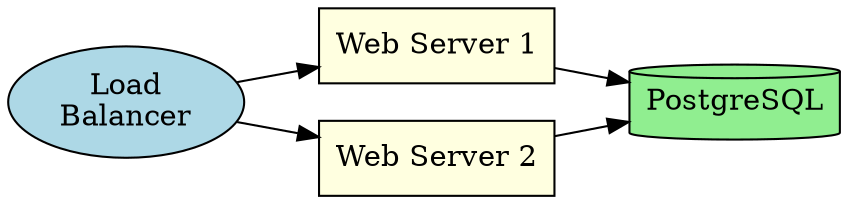

# Kroki Reference — Diagram Types and API

Kroki is a unified API that renders 28+ diagram types from text to SVG/PNG. Public endpoint: `https://kroki.io`

## API Usage (POST — simplest method)

```bash
curl -X POST https://kroki.io/{diagram_type}/svg \
  -H "Content-Type: text/plain" \
  -d 'diagram source here'
```

**Always use SVG output** — it is supported by all diagram types.

## Recommended Diagram Types by Use Case

| Use Case | Type | `kroki_diagram_type` | Notes |
|---|---|---|---|
| Architecture (C4 model) | C4 PlantUML | `c4plantuml` | Formal C4 Context/Container/Component diagrams |
| Architecture (informal) | D2 | `d2` | Modern, clean, supports nesting + SQL tables |
| Database schema / ER | DBML | `dbml` | Purpose-built for DB docs, cleanest output |
| Network topology | GraphViz | `graphviz` | DOT language, powerful auto-layout |
| Dependency graphs | GraphViz | `graphviz` | Best for complex graph layouts |
| UML (class, activity, deployment) | PlantUML | `plantuml` | Most comprehensive UML tool |
| Mind maps | PlantUML | `plantuml` | Use `@startmindmap` syntax |
| ASCII art to diagram | SvgBob | `svgbob` | Converts ASCII to clean SVG |
| Data visualization | Vega-Lite | `vegalite` | Charts: bar, line, scatter, etc. |
| Server rack layout | RackDiag | `rackdiag` | Specialized rack diagrams |
| Network diagrams | NwDiag | `nwdiag` | Network topology |
| Packet structure | PacketDiag | `packetdiag` | Protocol packet layouts |

**Note:** Flowcharts, sequence diagrams, ER diagrams, class diagrams, state diagrams, Gantt charts should use **Mermaid** (rendered client-side, no Kroki needed).

## Diagram Syntax Examples

### GraphViz (DOT) — `graphviz`



### C4 PlantUML — `c4plantuml`

```
@startuml
!include <C4/C4_Container>
Person(user, "User", "End user")
System_Boundary(sys, "System") {
    Container(web, "Web App", "React", "Frontend")
    Container(api, "API", "Spring Boot", "Backend")
    ContainerDb(db, "Database", "PostgreSQL", "Storage")
}
Rel(user, web, "Uses", "HTTPS")
Rel(web, api, "Calls", "JSON/HTTPS")
Rel(api, db, "Reads/Writes", "JDBC")
@enduml
```

### D2 — `d2`

```d2
direction: right
client: Client { shape: person }
services: Backend {
    api: API Server
    db: PostgreSQL { shape: cylinder }
    api -> db: queries
}
client -> services.api: HTTPS
```

### D2 SQL Table — `d2`

```d2
users: {
    shape: sql_table
    id: int {constraint: primary_key}
    name: varchar
    email: varchar {constraint: unique}
}
orders: {
    shape: sql_table
    id: int {constraint: primary_key}
    user_id: int {constraint: foreign_key}
}
users.id <-> orders.user_id
```

### DBML — `dbml`

```dbml
Table users {
    id integer [primary key, increment]
    username varchar [not null, unique]
    email varchar [not null]
    role user_role [default: 'user']
}
Table posts {
    id integer [primary key, increment]
    title varchar [not null]
    user_id integer [ref: > users.id]
}
Enum user_role { admin user moderator }
```

### PlantUML — `plantuml`

```
@startuml
actor User
participant "Web App" as WA
participant "Auth Service" as Auth
database "User DB" as DB
User -> WA: Login(email, pass)
WA -> Auth: Authenticate
Auth -> DB: SELECT user
DB --> Auth: record
Auth --> WA: JWT
WA --> User: Set-Cookie
@enduml
```

### PlantUML Mind Map — `plantuml`

```
@startmindmap
* Project
** Planning
*** Requirements
*** Timeline
** Development
*** Backend
*** Frontend
** Testing
@endmindmap
```

### SvgBob — `svgbob`

```
    +--------+    +--------+    +--------+
    | Client |--->| Server |--->|   DB   |
    +--------+    +--------+    +--------+
```

### Vega-Lite — `vegalite`

```json
{
  "$schema": "https://vega.github.io/schema/vega-lite/v5.json",
  "data": { "values": [
    {"category": "A", "value": 28},
    {"category": "B", "value": 55},
    {"category": "C", "value": 43}
  ]},
  "mark": "bar",
  "encoding": {
    "x": {"field": "category", "type": "nominal"},
    "y": {"field": "value", "type": "quantitative"}
  }
}
```

## Colors and Theming

**CRITICAL: Kroki diagrams render on a LIGHT background in the viz panel.** Do not apply dark themes.

- **PlantUML**: Do NOT add `skinparam backgroundColor` or dark theme overrides. Default PlantUML colors are designed for light backgrounds and look great.
- **GraphViz**: Use light fill colors: `fillcolor=lightyellow`, `fillcolor=lightblue`, `fillcolor="#e8f4f8"`. Avoid dark fills.
- **D2**: Default colors work well. No dark theming needed.
- **DBML**: No color control — always renders well on light background.

## Limitations

- **D2**: SVG output only (no PNG/PDF)
- **DBML, Nomnoml, SvgBob, Bytefield, WaveDrom, Pikchr**: SVG only
- **POST body limit**: 1 MB
- **Timeout**: 20 seconds per conversion
- **PlantUML `!include` from URLs**: blocked on public instance (security)
- **Excalidraw/UMlet/BPMN**: JSON/XML input, not practical for hand-writing
